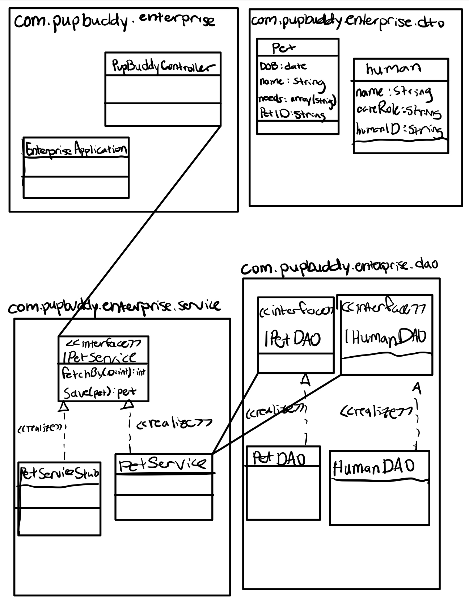

# pupBuddy with IntelliJIDEA on GitHub

## Introduction

Pup Buddy allows households to track and share daily chores related to their pet. Members of a household can log their daily pet-related chores to the database which displays for all users to see in a friendly UI. Users can also add pets, edit their needs, edit their household, or their own responsibilities in their profile.

## Storyboard

Storyboard created here using [Invision](https://tayloroblack394892.invisionapp.com/freehand/PupBuddy-Y1VzEPXLP)
  

## Functional Requirements

1. As a dog owner, I want to record dog care activities, so that I can remember what has already been done.

### Example

**Given**: A feed of dog care activities is available
**When**: The user/service selects the activity Feed Dinner
**When**: The user/service logs the Feed Dinner activity as Done for the date 1/28/2022
**Then**: The user’s/service’s Feed Dinner activity will be recorded as Done for the date 		1/28/2022

### Example

**Given**: The Feed Dinner activity has been logged as done for the date 1/28/2022
**When**: The user/service attempts to log the Feed Dinner activity as Done for the date 		1/28/2022
**Then**: Pup Buddy will return an error message informing the user that the Feed Dinner 		activity has already been recorded as Done for the date 1/28/2022

### Example

**Given**: A feed of dog care activities is available
**When**: The user/service selects the activity Walk Dog
**When**: The user/service logs the Walk Dog activity as Done for the date 1/28/2022 and 		the time 10:00 AM
**Then**: The user’s/service’s Walk Dog activity will be recorded as Done for the date 		1/28/2022 and the time 10:00 AM

2. As a dog owner, I want to add other individuals in my household to a group, so that I can coordinate dog care activities with everyone in the house.

### Example

**Given**: A feed of user account data is available
**When**: The user/service selects “Add members to household group”
**When**: The user/service selects an account to add to the household group
**Then**: The user/service’s invitation to join the household group is sent to the 		account selected

### Example

**Given**: An invitation to join a household group has been extended to an account
**When**: The user/service accepts the invitation
**Then**: The user is granted access to the household group 

### Example

**Given**: An invitation to join a household group has been extended to an account
**When**: The user/service declines the invitation
**Then**: The invitation is removed
**Then**: The sender of the invitation is notified that the invitation was declined

3. As a dog owner, I want to assign dog care tasks to members of my household, so that I can communicate dog care responsibilities to individuals.

### Example

**Given**: A feed of dog care activities are available
**When**: The user/service selects the Walk Dog activity
**When**: The user/service selects Assign This Activity
**When**: The user/service selects the account of another household group 			member
**When**: The user/service selects the date 1/28/2022 and the time 1:00 PM to 		assign the Walk Dog activity
**Then**: The Walk Dog activity will be assigned on the date 1/28/2022 and the time 		1:00 PM to the household group member selected  
**Then**: The household group member assigned the Walk Dog activity on the date 		1/28/2022 and the time 1:00 PM will be notified that the activity was 		assigned to them

### Example

**Given**: A user is the sole member of a group
**When**: The user/service selects Assign This Activity on any activity
**Then**: Pup Buddy will return an error message informing the user that they must 		add members to their household group before they can assign activities 		to others

4. As a dog owner, I want to set reminders for dog care tasks that are time sensitive, so that I can remember to complete them at the right time.

### Example

**Given**: A feed of dog care activities is available
**When**: The user/service selects the activity Feed Dinner
**When**: The user/service selects Set Reminder
**When**: The user/service enters 6:00 PM for the time and Daily for the reminder 		frequency
**Then**: The reminder will be saved for the Feed Dinner activity for 6:00 PM daily.
**Then**: Pup Buddy will send a notification to “Feed Dinner” Daily at 6:00 PM

### Example

**Given**: The activity Feed Dinner has a reminder set for 6:00 PM daily
**When**: The user/service selects the activity Feed Dinner
**When**: The user/service selects Set Reminder
**Then**: The reminder page for Feed Dinner will open, where the user can edit the 		current reminder or add more reminders

## Class Diagram

### Class Diagram Description

Our pupBuddy Controller uses our enterprise service interface. That interface is built from the pupBuddy enterprise DAO.

##	JSON Schema

### DOG

>{
>   "dogID":"ID",
>   "name":"String",
>   "breed":"String",
>   "age":"int",
>   "houseID":"ID"
>}
### HOUSE

>{
>	"houseID": "ID",
>	"dog(s)": [{
>		"dogID": "ID"
>	}],
>	"human(s)": [{
>		"humanID": "ID"
>	}],
>	"chore(s)": [{
>		"choreID": "ID"
>	}]
>}

### HUMAN

>{
>   "humanID":"ID",
>   "name":"String",
>   "careRole":"String"
>}

### CHORES

>{
>   "choreID":"ID",
>   "choreName":"String",
>   "choreComplete":"boolean",
>   "choreStart":"Date",
>   "choreEnd":"Date",
>   "dogID":"ID",
>   "humanID":"ID"
>}

## Scrum Roles

### Scrum Master – *Tony Herrera*
### UI/UX - *Taylor O’Black*
### Backend/DB – *Molly Bischoff*
### Integration developer – *November Harris*

## Link to Project on GitHub

[pupBuddy](https://github.com/Yep-Was-Taken/pupBuddy)

## Kanban board using GitHub projects

[Project overview on GitHub](https://github.com/Yep-Was-Taken/pupBuddy/projects/1)

## Link to Teams Standup

[We meet 3:00pm EST on Thursday on Teams](https://teams.microsoft.com/l/meetup-join/19%3ameeting_YmNiYTE2YmEtY2VmMS00MTU5LWI3MzctOTI3OGY1YzVjMWE2%40thread.v2/0?context=%7b%22Tid%22%3a%22f5222e6c-5fc6-48eb-8f03-73db18203b63%22%2c%22Oid%22%3a%229a9d29f6-e526-4f31-9f1d-5f3c61729f4d%22%7d)